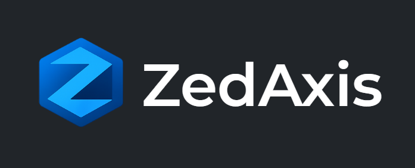
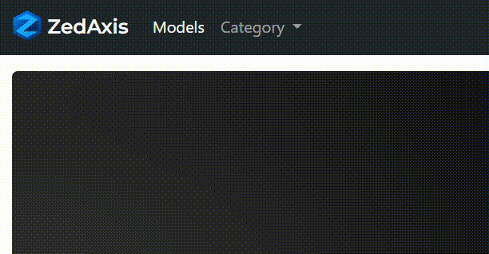
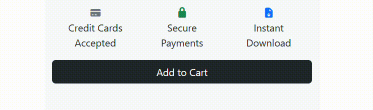
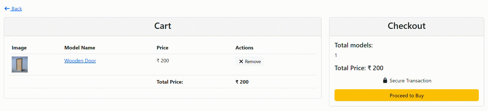
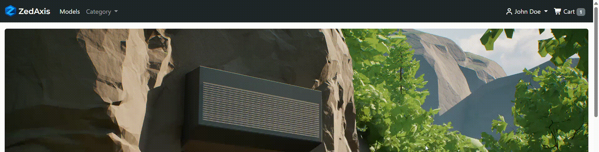
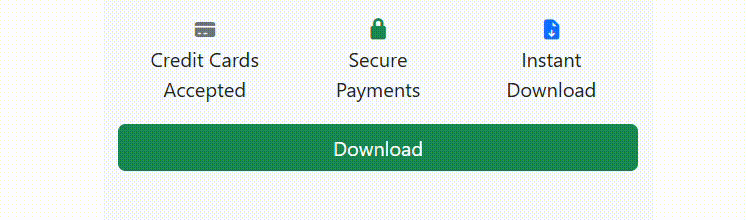
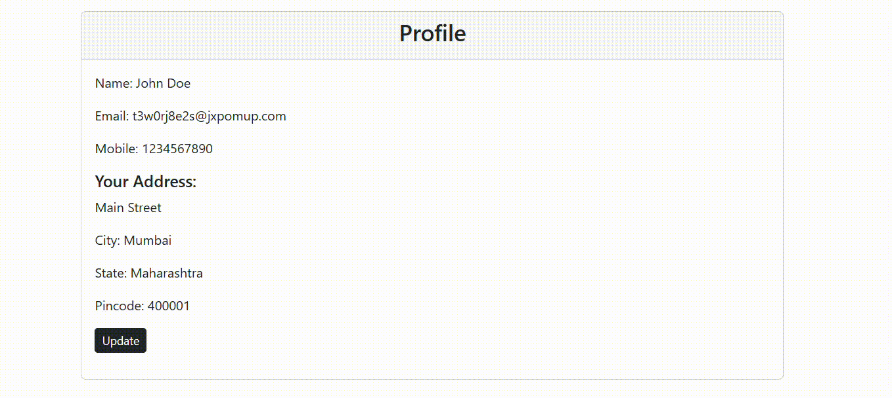
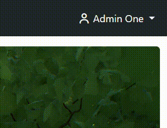
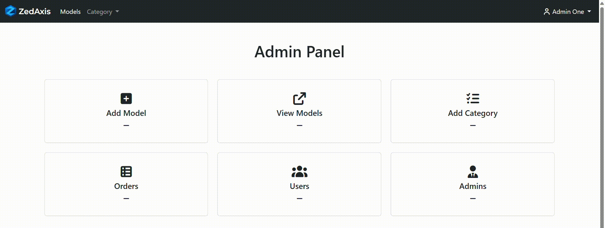

# ZedAxis - ECommerce Platform

View live demo:
[ZedAxis](http://zedaxis.ap-south-1.elasticbeanstalk.com)

This Webapp allows users to buy items, add items to cart, remove items from cart, and download the items after purchase.
Admins can create listings, edit listings, manage orders, manage users, and manage admins.

## User Guide
### Browse Categories
Select available category

### Add to cart
Add a model to cart

### Checkout cart
Click cart icon to check out cart, you can remove models from cart

### View orders
Click on profile name -> View Orders

### Download
Purchased models can be downloaded by visiting model page

### Update profile
You can update profile details by clicking on profile name -> Profile -> Update

## Admin Guide
### Open admin panel
Open admin panel by logging in with admin account and clicking on profile name -> Admin panel

### Perform admin actions
Click available action to perform an action

## Tech Stack
### Frontend
- HTML
- CSS
- Bootstrap
- Thymeleaf (for server-side rendering)

### Backend
- Spring Boot
- MySQL 
- AWS S3 (for file storage)

### Dev Tools
- Git and GitHub
- Intellij IDEA, Visual Studio Code
- ~~Deployed on AWS Elastic Beanstalk~~
- Deployed on Render
- ~~Database hosted on AWS RDS~~
- Database hosted on Aiven
- Images are used for demonstration purpose only